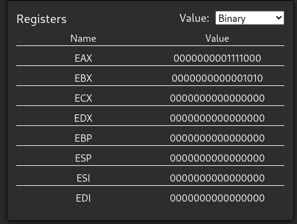

# 8086 Emulator Javascript

### Demo :  http://emu8086.pythonanywhere.com/

An 8086 Emulator that runs in the browser. It has a highlighted code editor, 3 cards - one displaying the flags, another displaying the 64 bits registers and the last displaying the half 8 bits registers of every A, B, C, D register. It can compile code and display the final result or step through each instruction while seeing the values change in real time.

# Short Description

An web app assembled from 2 pieces: a frontend written in React.js made for the user to interact with and a backend written in Python.
The backend deals with the processing - uses the unicorn and keystone engine libraries 
The frontend deals with the state of the app - for instance, if there's new code added you must first compile before running, or when compiling, the values of all registers reset to 0.
The frontend also can display the values under 3 formats: decimal, binary and hexadecimal.

# Installation

\* The javascript files are already compiled in the build folder, so there is no need to run node.js. Also, any changes done to the uncompiled JS files will not change anything on the application. \
\
\* You need to have python and pip installed for this to work.

* Clone this repository with git
* Go to the folder named "server" and open a terminal here
* Run "pip install -r requirements.txt" - this will install the neccessary libs
* After the installation is done, run "python -m flask run"
* Open the link displayed in the terminal and you're done.

# Functionalities

* The user can write code on a highlighted text editor.
* The user can add comments to the code using ';'.
* Run guard - You cannot run the program until you compile it first.
* Can compile and run as many times as the user wants without breaking.
* Error pop-up in case the code contains errors and application does not stop.
* User can run the program once and get the final results.
* User can run the program on every instruction and see the results after each step in real time.
* User can convert the values of the registers to decimal, binary and hexadecimal.

# Implementation
\* Problem solved: Had to switch to a python backend due to the fact that the Unicorn library for Javascript got discontinued and was not fully developed.

The python script named server.py runs a Flask server with 3 routes
* \ - which provides the html that runs the Javascript files.
* \post - used to receive the code text from the frontend 
* \get - uset to send the results back to the frontend.

Uses the Keystone library to convert the ASCII text code received to a binary string of instructions. Then the instrusctions string is fed to a Unicorn Engine instance to run the emulation. With a custom hook function the script saves in a list of dictionaries every state of the registers and flags. At the end of the emulation another list is created to save the final state.

The result is then sent to the frontend where the user can see the final results or go through each step of the program until it reaches the final state.

# Screenshots
Application\

Code Editor\

Flags\

Registers\

# Examples

  https://windprophet.github.io/emu8086/

  8086 Emulator - displays memory, flags and registers.

  https://schweigi.github.io/assembler-simulator/

  Assembly emulator with an 8 bit CPU and only 256 bytes of memory.

  https://github.com/ihmels/asmsimulator

  16 bit CPU with 1024 bytes of memory.

  https://marie.js.org/